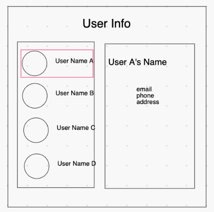

# User Info

You will be building a webpage based on the wireframe below:

The left hand pane is a list of user names and images (which can be found in the assets fodler), and the right hand side displays the full details about the selected user.

Your app should satisfy the following user stories:
1. When I first load the page, the top user in the left hand pane is selected, and the right hand pane displays their user details.
1. The selected user is designated by a colored border
1. When I click any user name in the left hand list, the right hand pane changes to display that user's information.
1. Only one user's information is displayed at a time in the right hand pane.
1. Some effort has been put into styling the page!

## Sample user data
FYI, this data was generated using https://randomuser.me/ (for all your future random user generating needs!)

- Melvin Fleming, melvin.fleming@example.com, (628)-834-3511, 4904 Rolling Green Rd
- Jerry Diaz, jerry.diaz@example.com, (034)-061-7169, 406 Elgin St
- Patsy Harper, patsy.harper@example.com, (500)-207-0486, 8281 Pecan Acres Ln
- Miriam Ross, miriam.ross@example.com, (350)-551-0412, 4154 Forest Ln
